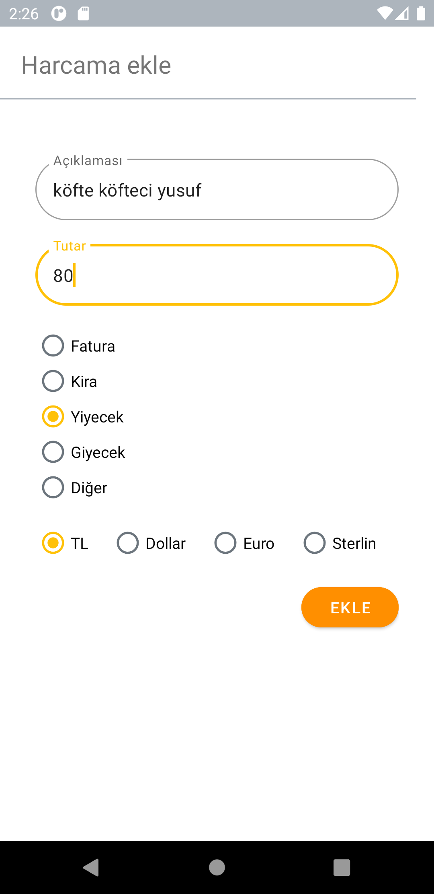
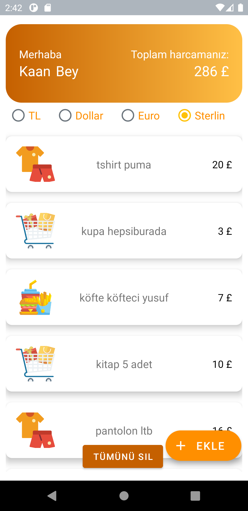
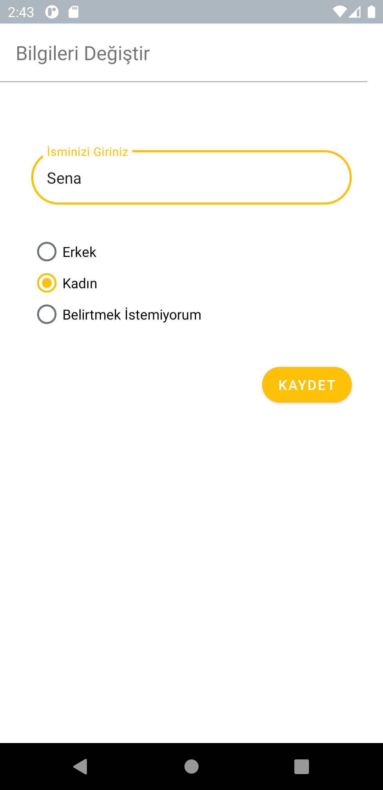
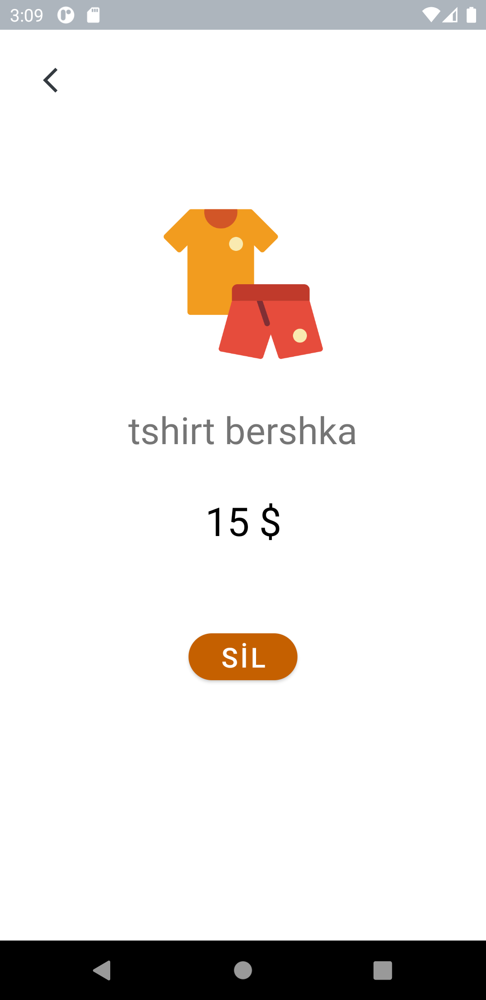

# Expense Tracker Plus

Bu uygulama GDG Android Bootcamp Türkiye etkinliği kapsamında, o yayınlar izlenilerek yapılmıştır. Etkinliğin bitirme projesidir.

Harcama Takip Uygulaması; harcamalarınızı istediğiniz ayrıntıyla kategorilendirip kaydederek, harcamalarınızı anlık kur ile farklı para birimlerinden de takip edebileceğiniz bir uygulama. Kişiye özel kullanıcı arayüzü bulunduruyor. Harcamanızın detayına ulaşabiliyorsunuz ve harcamalarınızı düzenleyebiliyorsunuz.

  
  
  
  
  
  

## Kullanılan teknolojiler, açıklamalarıyla birlikte:

* Açılışta ilk başta sizi hareketli bir **splash screen** karşılıyor.
* Devamında ilk defa giriş yaptığınızda 3 sayfalık bir **onboarding** ekranı size eşlik ediyor.
* Son onboarding ekranında adınızı giriyorsunuz ve uygulamaya başlıyorsunuz.
* **Uygulama simgesi** değiştirilmiştir. Uygulamanın simgesi uygulamanın temasına uyumlu bir şekilde değiştirilmiştir. Bütün uygulama boyunca uyumlu bir temada olduğunu görüp hissedeceksiniz.
* **Room Database** kullandım. Mehmet Ali Hoca'mın anlattığı.
* **Navigation** kullandım. Okan Aydın Hoca'mın anlattığı.
* **View Binding / Data Binding** kullanılmıştır.
* **Retrofit** teknolojisi kullanılmıştır.
* **RecyclerView** kullandım yine Mehmet Ali Hoca'mın anlattığı.
* **TL Dolar Euro Sterlin** para birimleri vardır.
* **İsim Değiştirme Ekranı** vardır.
* **Kullanıcı harcamasını farklı birimlerde ekleyebiliyor.**
* **En az 3 harcama çeşidi vardır. (Fatura, kira, yiyecek, giyecek, diğer vb.)**
* **Kullanıcı para birimini değiştirdiğinde Recycler'da gösterilen bütün veriler ve harcama değişir**
* **Offline kullanılabilir.**

## Uygulamanın özellikleri:

#### Adınızı değiştirebileceğiniz bir bölüm

#### Renkli uyumlu bir tema

#### Harcamalarınız arasında gezinebilirsiniz.

#### Farklı para birimlerinde harcamalarınızı görün.

#### Harcamalarınızı ekleyip çıkarabilirsiniz. Dilerseniz tümünü de silebilirsiniz.

#### Harcamanın üzerine tıklayıp harcamanın detay sayfasına da gidebilirsiniz.

#### Sürekli değişen kur 🥴

#### Harcamalarınızı kategorilendirebilirsiniz: Neye ne kadar harcadığınızı buradan takip edip tutumluluk yapabilirsiniz. 🤑

## Yararlandığım kaynaklar:

* [Google Developer Communities Turkey](https://www.youtube.com/channel/UCwHGWX8X0TqGXMb-Q_GkmPg)
* [flaticon](https://www.flaticon.com/)
* [LottieFiles](https://lottiefiles.com/)
* [ICONFINDER](https://www.iconfinder.com/)
* [ExchangeRate-API](https://app.exchangerate-api.com/dashboard)
